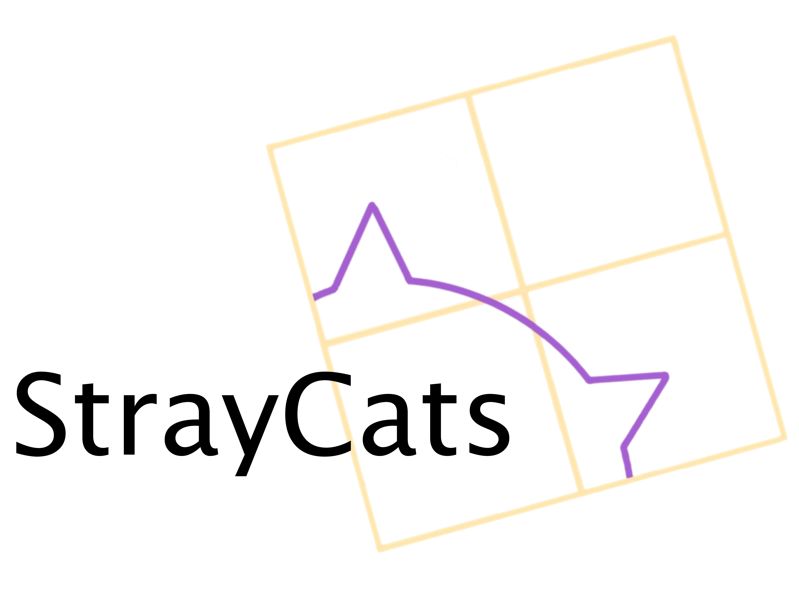

# StrayCats: The *NuSTAR* Stray Light Source Catalog

## Usage and Citations

The StrayCats paper has been published into ApJ! Please use the [ADS entry for the paper](https://ui.adsabs.harvard.edu/abs/2021ApJ...909...30G/abstract) to find published version (which includes the FITS table provided here) and the arXiv preprint. If you find the StrayCats catalog useful, please cite our paper and/or get in touch!

---

## [StrayCats Summary Table for all Sources with Products](summary2/straycats_summary)

## [StrayCats Summary Table for all Sources](summary/straycats_summary)

---

## Science Papers that use Stray Light data:

- ["Measurement of the Absolute Crab Flux with NuSTAR"", Madsen et al. (2017)](https://ui.adsabs.harvard.edu/abs/2017ApJ...841...56M/abstract)

- ["StrayCats: A Catalog of NuSTAR Stray Light Observations", Grefenstette et al. (2021)](https://ui.adsabs.harvard.edu/abs/2021ApJ...909...30G/abstract)

- ["Extending the Baseline for SMC X-1's Spin and Orbital Behavior with NuSTAR Stray Light", Brumback et al. (2022)](https://ui.adsabs.harvard.edu/abs/2022ApJ...926..187B/abstract)

---

## Summer Undergraduate Research Fellowships based on Stray Light data:

- ["Analyzing Straylight X-ray Binaries with NuSTAR", Catherine Slaughter (2020)](web_resources/pdfs/surf_2020_slaughter.pdf)

- ["GS 1826-24 with NuSTAR Stray Light ", Hazel Yun (2021)](web_resources/pdfs/surf_2021_yun.pdf)

- ["Stray Light View of Accreting Atolls: GX 9+9", Lynn Yang (2021)](web_resources/pdfs/surf_2021_yang.pdf)

---

## Posters on StrayCats

- ["StrayCats: A catalog of NuSTAR Stray Light Observations", Brian Grefenstette at HEAD19 (2022)](web_resources/pdfs/grefenstette_HEAD19_poster.pdf)

- ["Extending the baseline for SMC X-1’s spin and orbital behavior with NuSTAR stray light", McKinley Brumback at HEAD19 (2022)](web_resources/pdfs/Brumback_HEAD19poster_withQRcode.pdf)

---

## Catalog Links

- [HTML version of StrayCats Catalog sorted by RA of the Stray Light Source](tables/straycats_sorted_table)

- [HTML version of the complete StrayCats Catalog](tables/straycats_table)

- [Unidentified Stray Light Sources](tables/straycats_table_unknowns)

- ["Complex" Stray Light Sources](tables/straycats_table_complex)

- [FITS version of the StrayCats Catalog](tables/straycats.fits)

---

## Sky distribution of Stray Light sources

<iframe id="igraph" scrolling="no" style="border:none;" seamless="seamless" src="https://NuSTARStrayCats.github.io/straycats/plotly_figs/straycat_radec.html" height="540" width="960"></iframe>

--- 

## Galactic distribution of Stray Light sources. Underlying image is the [ESO Milky Way panorama](https://www.eso.org/public/images/eso0932a/)
### Use the 'Zoom' tool to manipulate this image rather than the "Box Select" tool.
<iframe id="igraph" scrolling="no" style="border:none;" seamless="seamless" src="https://NuSTARStrayCats.github.io/straycats/plotly_figs/galaxy_overlay.html" height="540"  width="960"></iframe>

---

### The columns of the StrayCats FITS file are:

1. StrayID:

    The Catalog identifier, which is StrayCatsI_XX where XX is the row number after the catalog is sorted the RA and Dec for the focused NuSTAR sequence ID.

2. Classification

   The classifications are:
   1. 'SL': Identified stray light source
   2. 'Complex': Multiple overlapping SL sources are present, difficult to analyze)
   3. 'Faint': Potential faint stray light
   4. 'GR': Ghost-rays from a source just outside of the FoV
   5. 'Unkn': Stray light from an unidentified source

3. SEQID

    The NuSTAR sequence ID
    
4. Module

    The NuSTAR FPM that contains the stray light (A or B)
    
5. Exposure

    The exposure time for this observation in seconds
    
6. Multi (FITS only)

    Whether the sequence ID contains multiple stray light patterns (Yes/No) 

7. Primary

    Primary Target

8. Time

    MJD time of the observation
    
9. RA / DEC of the Primary

10. SL Source

    If identified, otherwise ??
    
11. SL Type

    If we have identified the type of the object, this will be here
    
12. SIMAD_ID

    ID for the source in SIMBAD
    
13. RA/Dec of SL source

    If known. Otherwise -999
    
--- 

